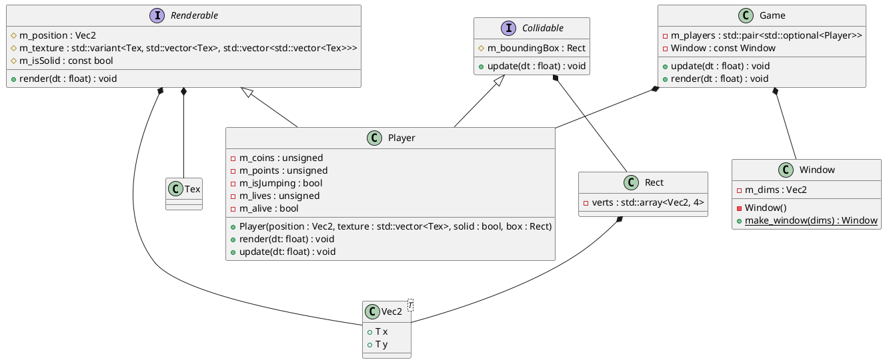

```plantuml

@startuml

Renderable *-- Vec2
Renderable *-- Tex

interface Renderable {
    #m_position : Vec2
    #m_texture : std::variant<Tex, std::vector<Tex>, std::vector<std::vector<Tex>>>
    #m_isSolid : const bool
    +render(dt : float) : void
}

 Collidable *-- Rect

interface Collidable {
    #m_boundingBox : Rect
    +update(dt : float) : void
}

Rect *-- Vec2

class Rect {
    -verts : std::array<Vec2, 4>
}


class Vec2<T> {
    +T x
    +T y
}

Collidable <|-- Player
Renderable <|-- Player


class Player {
    -m_coins : unsigned
    -m_points : unsigned
    -m_isJumping : bool
    -m_lives : unsigned
    -m_alive : bool
    +Player(position : Vec2, texture : std::vector<Tex>, solid : bool, box : Rect)
    +render(dt: float) : void
    +update(dt: float) : void
}

class Window {
    -m_dims : Vec2
    -Window()
    +{static}make_window(dims) : Window
}

Game *-- Window
Game *-- Player

class Game {
    -m_players : std::pair<std::optional<Player>>
    -Window : const Window
    +update(dt : float) : void
    +render(dt : float) : void
}

@enduml
```