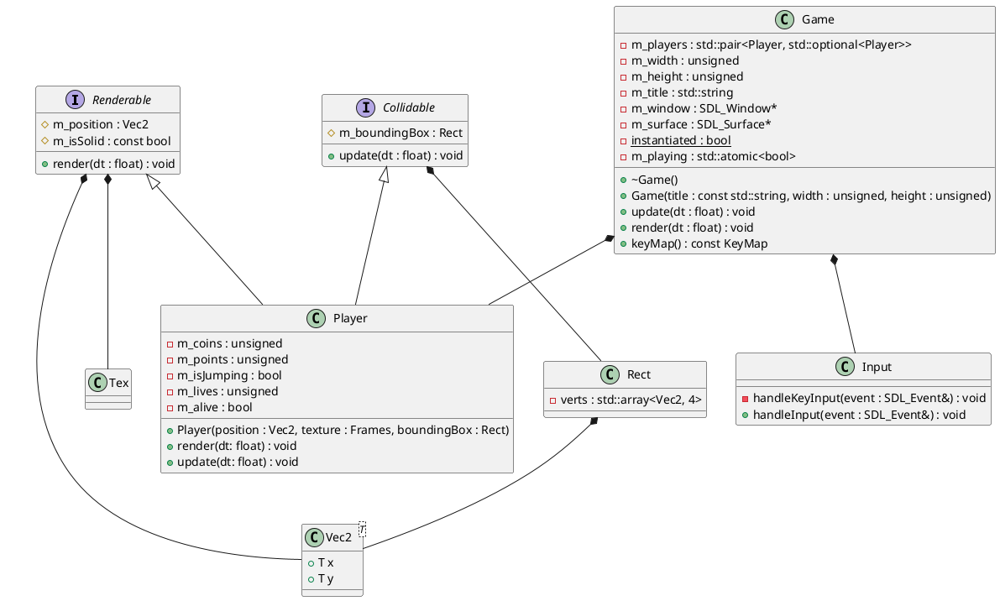

```plantuml


@startuml

Renderable *-- Vec2
Renderable *-- Tex


interface Renderable {
    #m_position : Vec2
    #m_isSolid : const bool
    +render(dt : float) : void
}

 Collidable *-- Rect

interface Collidable {
    #m_boundingBox : Rect
    +update(dt : float) : void
}

Rect *-- Vec2

class Rect {
    -verts : std::array<Vec2, 4>
}


class Vec2<T> {
    +T x
    +T y
}

Collidable <|-- Player
Renderable <|-- Player


class Player {
    -m_coins : unsigned
    -m_points : unsigned
    -m_isJumping : bool
    -m_lives : unsigned
    -m_alive : bool
    +Player(position : Vec2, texture : Frames, boundingBox : Rect)
    +render(dt: float) : void
    +update(dt: float) : void
}

class Input {
    -handleKeyInput(event : SDL_Event&) : void
    +handleInput(event : SDL_Event&) : void
}

Game *-- Player
Game *-- Input

class Game {
    -m_players : std::pair<Player, std::optional<Player>>
    -m_width : unsigned
    -m_height : unsigned
    -m_title : std::string
    -m_window : SDL_Window*
    -m_surface : SDL_Surface*
    -{static}instantiated : bool
    -m_playing : std::atomic<bool>
    +~Game()
    +Game(title : const std::string, width : unsigned, height : unsigned)
    +update(dt : float) : void
    +render(dt : float) : void
    +keyMap() : const KeyMap
}

@enduml
```