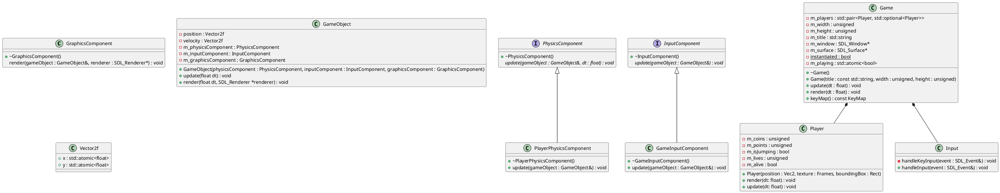

```plantuml


@startuml

class GraphicsComponent {
    +~GraphicsComponent()
    render(gameObject : GameObject&, renderer : SDL_Renderer*) : void
}

interface PhysicsComponent {
    +~PhysicsComponent()
    {abstract}update(gameObject : GameObject&, dt : float) : void
}

interface InputComponent {
    +~InputComponent()
    {abstract}update(gameObject : GameObject&) : void
}

InputComponent <|-- GameInputComponent

class GameInputComponent {
    +~GameInputComponent()
    +update(gameObject : GameObject&) : void
}

PhysicsComponent <|-- PlayerPhysicsComponent

class PlayerPhysicsComponent {
    +~PlayerPhysicsComponent()
    +update(gameObject : GameObject&) : void
}


class GameObject {
   -position : Vector2f
   -velocity : Vector2f
   -m_physicsComponent : PhysicsComponent
   -m_inputComponent : InputComponent
   -m_graphicsComponent : GraphicsComponent
   +GameObject(physicsComponent : PhysicsComponent, inputComponent : InputComponent, graphicsComponent : GraphicsComponent) 
   +update(float dt) : void
   +render(float dt, SDL_Renderer *renderer) : void
}

class Vector2f {
    +x : std::atomic<float>
    +y : std::atomic<float>
}


class Player {
    -m_coins : unsigned
    -m_points : unsigned
    -m_isJumping : bool
    -m_lives : unsigned
    -m_alive : bool
    +Player(position : Vec2, texture : Frames, boundingBox : Rect)
    +render(dt: float) : void
    +update(dt: float) : void
}

class Input {
    -handleKeyInput(event : SDL_Event&) : void
    +handleInput(event : SDL_Event&) : void
}

Game *-- Player
Game *-- Input

class Game {
    -m_players : std::pair<Player, std::optional<Player>>
    -m_width : unsigned
    -m_height : unsigned
    -m_title : std::string
    -m_window : SDL_Window*
    -m_surface : SDL_Surface*
    -{static}instantiated : bool
    -m_playing : std::atomic<bool>
    +~Game()
    +Game(title : const std::string, width : unsigned, height : unsigned)
    +update(dt : float) : void
    +render(dt : float) : void
    +keyMap() : const KeyMap
}

@enduml
```